# Tutorial Instalasi Android Studio & Emulator

**Mata Kuliah:** Pemrograman Aplikasi Perangkat Bergerak (PAPB)  
**Nama:** Ariz  
**NIM:** 14523057  
**Repository:** [https://github.com/arizzira/PAPB](https://github.com/arizzira/PAPB)

**NB: Saya memakai Linux Ubuntu**

---

## Daftar Isi
1. [Persiapan: Instalasi Java SDK (JDK)](#1-persiapan-instalasi-java-sdk-jdk)
2. [Unduh Android Studio](#2-unduh-android-studio)
3. [Proses Instalasi](#3-proses-instalasi)
   - [Instalasi di Ubuntu Linux](#instalasi-di-ubuntu-linux)
   - [Instalasi di Windows](#instalasi-di-windows)
4. [Konfigurasi Awal (Setup Wizard)](#4-konfigurasi-awal-setup-wizard)
5. [Membuat dan Menjalankan Emulator (AVD)](#5-membuat-dan-menjalankan-emulator-avd)
6. [Menjalankan Project Pertama](#6-menjalankan-project-pertama)

---

## 1. Persiapan: Instalasi Java SDK (JDK)

Sebelum menginstal Android Studio, kita perlu memastikan bahwa Java Development Kit (JDK) sudah terinstal di sistem. Versi yang sangat disarankan dan stabil untuk pengembangan Android saat ini adalah **OpenJDK 17**.

### Instalasi di Ubuntu Linux:
Buka terminal (`Ctrl + Alt + T`) dan jalankan perintah pembaruan repositori beserta instalasi JDK:

    sudo apt update

    
    sudo apt install openjdk-17-jdk -y
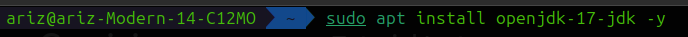
Setelah proses instalasi selesai, verifikasi bahwa Java sudah terinstal dengan benar dengan mengecek versinya:

    java -version
    javac -version
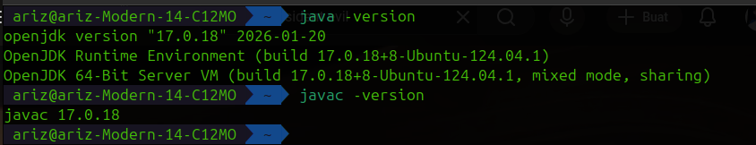

### Instalasi di Windows:
1. Unduh installer JDK 17 dari situs [Adoptium (Eclipse Temurin)](https://adoptium.net/) atau Oracle.
2. Jalankan installer `.exe` dan ikuti instruksi hingga selesai.
3. Pastikan untuk mencentang opsi **"Set JAVA_HOME environment variable"** saat proses instalasi agar Java dapat dikenali oleh sistem secara otomatis.

---

## 2. Unduh Android Studio

Langkah selanjutnya adalah mengunduh file resmi Android Studio.

1. Buka browser dan kunjungi situs resmi: [https://developer.android.com/studio](https://developer.android.com/studio).
2. Klik tombol **Download Android Studio**.
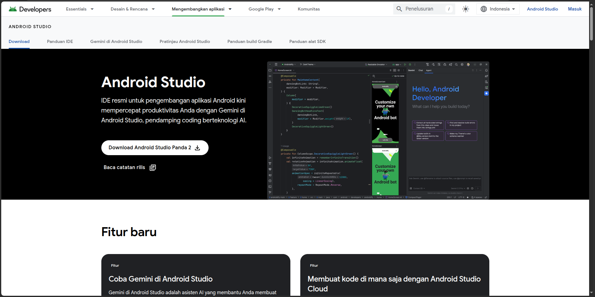
3. Centang kotak persetujuan *Terms and Conditions*, lalu unduh *installer* sesuai sistem operasi yang digunakan (Windows `.exe` atau Linux `.tar.gz`).
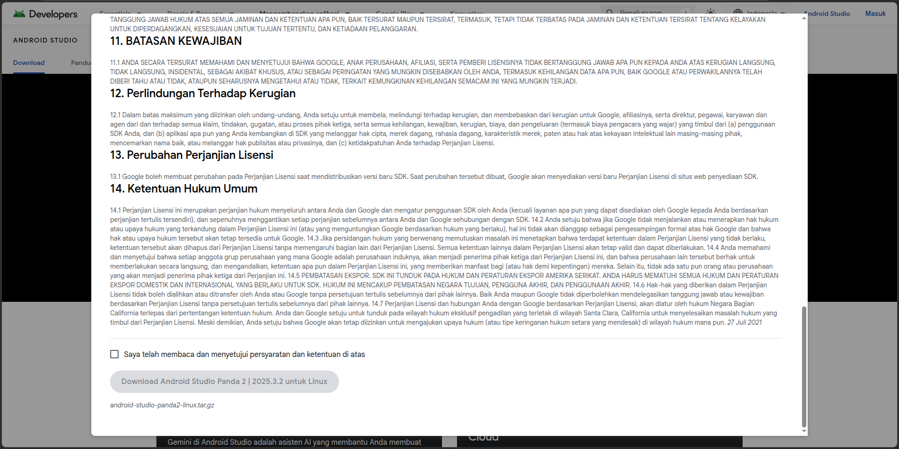  
4. **Penting:** Pastikan proses *download* selesai 100% sebelum lanjut ke tahap instalasi.

---

## 3. Proses Instalasi

### Instalasi di Ubuntu Linux

Untuk pengguna Ubuntu Linux, terdapat dua cara instalasi. Cara pertama (via Snap) sangat direkomendasikan karena lebih instan dan otomatis.

**Cara 1: Menggunakan Snap (Rekomendasi)**
Buka terminal (`Ctrl + Alt + T`) dan jalankan perintah berikut:

    sudo snap install android-studio --classic

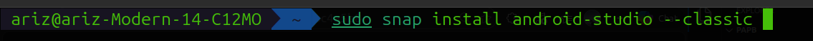
Tunggu hingga proses unduh dan instalasi selesai. Setelah itu, Android Studio bisa langsung dicari di menu aplikasi.

**Cara 2: Menggunakan File Tarball (.tar.gz)**
Jika ingin menginstal secara manual dari file yang sudah diunduh pada Tahap 2:

1. Buka terminal.
2. Ekstrak file `.tar.gz` ke direktori `/opt/`:

       sudo tar -xvzf ~/Downloads/android-studio-*.tar.gz -C /opt/
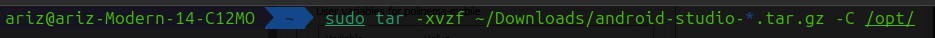
   *(Catatan: Pastikan file installer benar-benar ada di dalam folder Downloads).*
3. Masuk ke direktori `bin` dan jalankan aplikasinya:

       cd /opt/android-studio/bin
       ./studio.sh
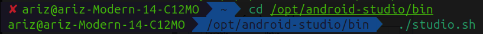
4. Saat aplikasi terbuka, klik menu **Tools > Create Desktop Entry** agar Android Studio muncul di menu aplikasi.

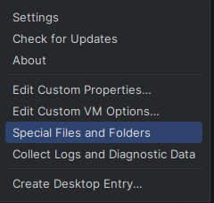

### Instalasi di Windows
1. Jalankan file `.exe` yang telah diunduh pada Tahap 2.
2. Pada layar *Welcome*, klik **Next**.
3. Di layar *Choose Components*, pastikan **Android Studio** dan **Android Virtual Device** dicentang, lalu klik **Next**.
4. Biarkan direktori instalasi secara *default*, klik **Next**, lalu **Install**.
5. Setelah selesai, centang **Start Android Studio** dan klik **Finish**.

---

## 4. Konfigurasi Awal (Setup Wizard)

Saat Android Studio pertama kali dijalankan, kita perlu mengunduh *Android SDK* (Software Development Kit).

1. Pada jendela **Android Studio Setup Wizard**, klik **Next**.
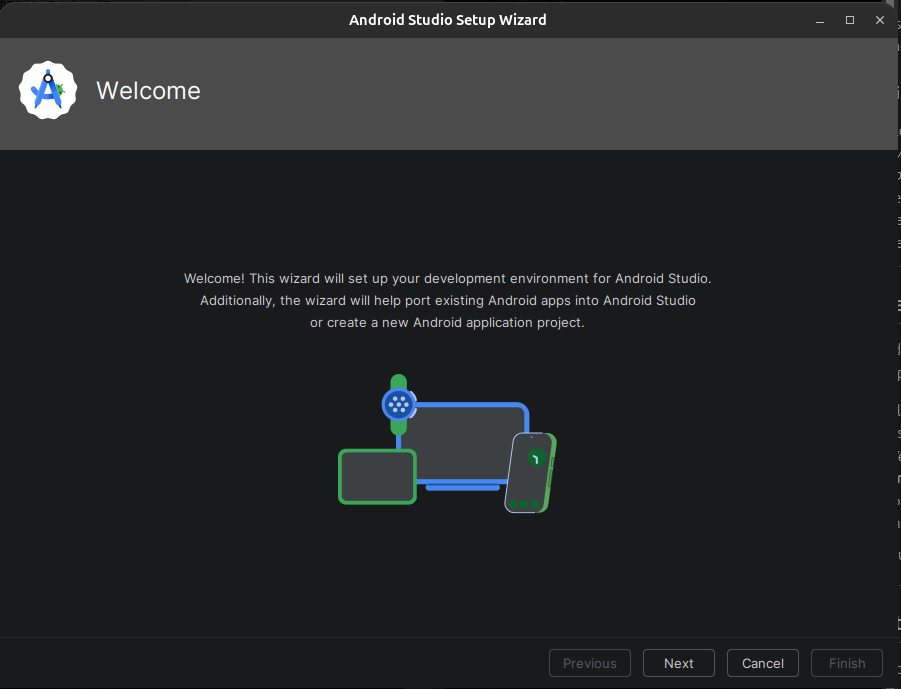
2. Pilih tipe instalasi **Standard** lalu klik **Next**.
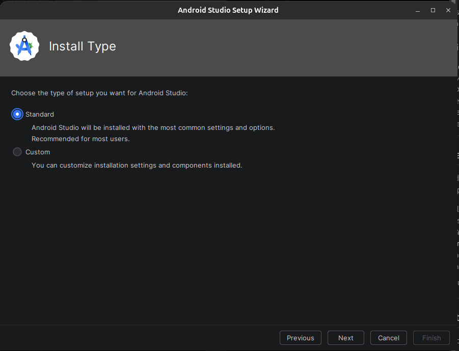
3. Di bagian *Verify Settings*, pastikan **Android SDK**, **Android SDK Platform**, dan **Android Emulator** ada di dalam daftar yang akan diunduh. Klik **Next** / **Finish**.
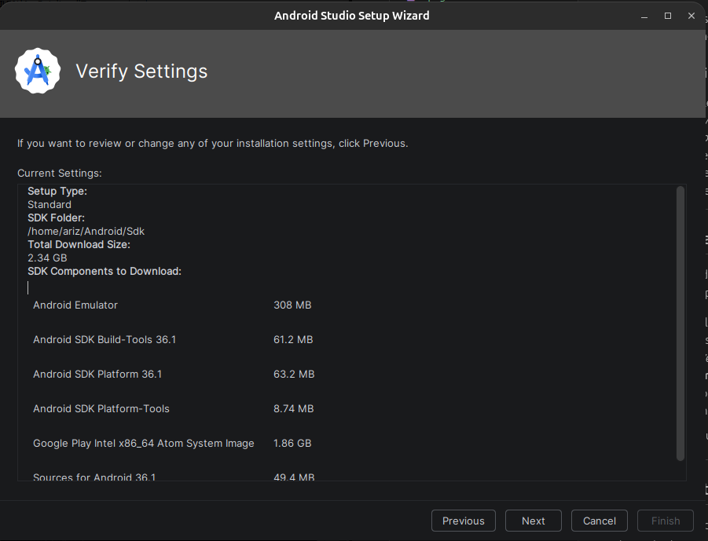
4. Tunggu proses *download* komponen selesai. Membutuhkan koneksi internet yang stabil karena ukurannya cukup besar. Setelah selesai, klik **Finish**.
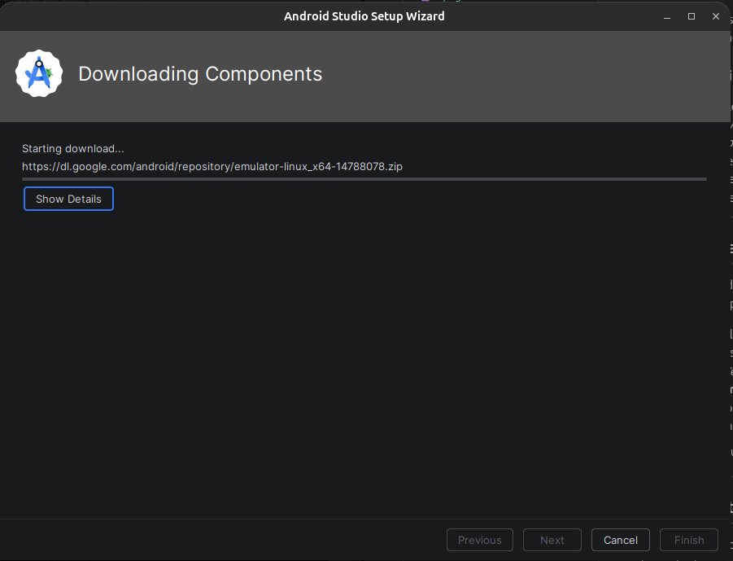

---

## 5. Membuat dan Menjalankan Emulator (AVD)

Emulator (Android Virtual Device) digunakan untuk menjalankan aplikasi langsung di komputer tanpa perlu HP fisik.

**Khusus Pengguna Linux (Akselerasi KVM):** Agar emulator berjalan lancar dan tidak berat, aktifkan KVM di terminal:

    sudo apt install qemu-kvm libvirt-daemon-system libvirt-clients bridge-utils
    sudo adduser $USER kvm

*(Lakukan log out dan log in kembali pada komputer setelah menjalankan perintah ini).*

**Langkah Membuat Emulator:**
1. Pada halaman awal Android Studio, klik ikon **More Actions** (tiga titik) dan pilih **Virtual Device Manager**.
2. Klik tombol **Create Device** (atau ikon `+`).
3. Pilih kategori **Phone**, lalu pilih resolusi seperti **Pixel 6**. Klik **Next**.
4. Pilih **System Image** (versi Android). Pilih versi terbaru, jika belum ada klik ikon *Download* di sebelahnya. Setelah selesai, klik **Next**.
5. Beri nama emulator pada kolom **AVD Name**, pastikan orientasi **Portrait**, lalu klik **Finish**.
6. Klik ikon **Play** (segitiga) di sebelah nama emulator untuk menjalankannya. Tunggu hingga layar utama Android muncul.

<!--  **SS NYUSUL**  -->

---

## 6. Menjalankan Project Pertama

1. Di halaman awal Android Studio, klik **New Project**.
2. Pilih **Empty Views Activity**, lalu klik **Next**.
3. Beri nama aplikasi (misal: `TugasPAPB`), pilih bahasa **Kotlin** atau **Java**, dan klik **Finish**.
4. Tunggu proses *Gradle Sync* selesai (indikator *loading* di pojok kanan bawah hilang).
5. Pastikan nama emulator muncul di menu *dropdown* atas.
6. Klik tombol **Run 'app'** (ikon Play warna hijau).
7. Aplikasi "Hello World" akan terbuka di dalam emulator!

<!--    **SS NYUSUL**  -->

---
*Tutorial ini disusun untuk memenuhi tugas mata kuliah Pemrograman Aplikasi Perangkat Bergerak (PAPB).*